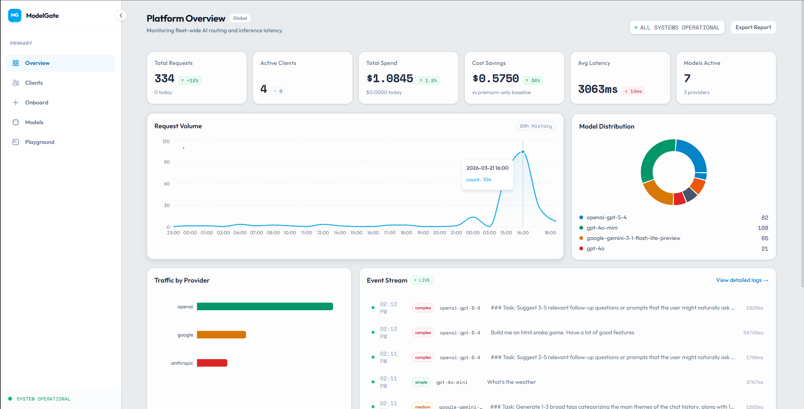
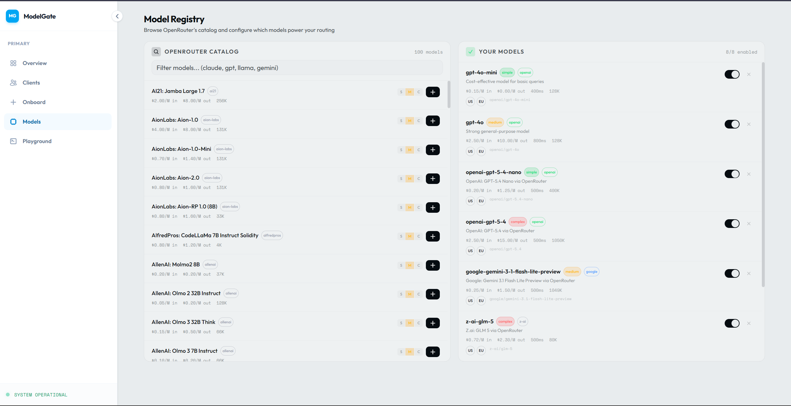
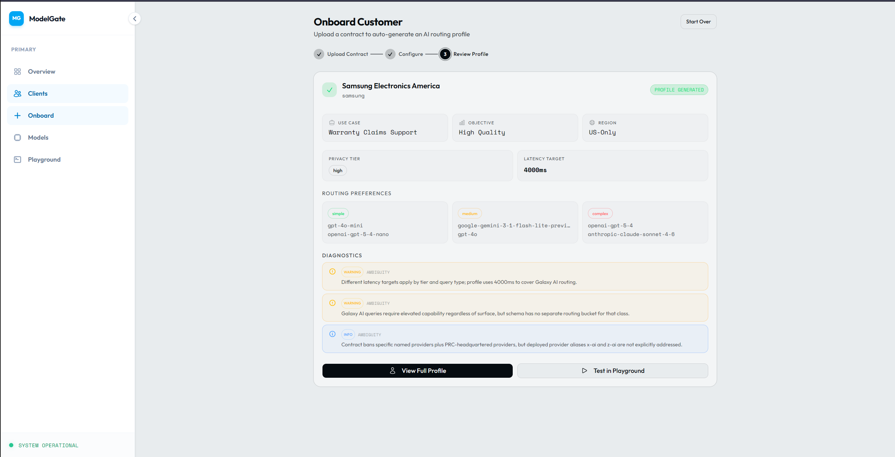

<p align="center">
  
</p>

# ModelGate

**Intelligent AI Routing - Built from Your Contracts**

One line of code changed. Millions of premium calls rerouted.

ModelGate is a contract-aware AI control plane that ingests customer contracts, extracts SLA/privacy/routing constraints, and generates an OpenAI-compatible endpoint that automatically routes every request to the optimal model. Simple queries go to cheap models. Complex queries go to premium ones. Contract compliance is enforced per request, automatically.

**3rd Place** at the KSU Social Good Hackathon 2026 - Assurant Track.

### Team Agents Assemble

| | Role |
|---|---|
| **[Aaryan Kapoor](https://www.linkedin.com/in/theaaryankapoor/)** | Lead Architect & AI Engineer |
| **[Pradyumna Kumar](https://www.linkedin.com/in/pradyum-kumar/)** | Platform Architect & Frontend |
| **[Danny Tran](https://www.linkedin.com/in/nam-tr%E1%BA%A7n-02973b2b6/)** | Design & Presentation Lead |

## Why

Over 30 new LLMs launched in the past month alone. No team has time to evaluate them all - so they pick one premium model and send everything to it. The result: 50-90% of enterprise AI spend is wasted on over-provisioned models, and premium models consume 180x more energy per query than small ones.

ModelGate fixes this. You change one line of code - your `base_url` - and we handle model selection, contract compliance, and cost optimization automatically.

## Results

### MMLU Routing Benchmark (60 questions, 6 subjects)

We benchmarked ModelGate against always routing to GPT-5.4 (default reasoning):

| | GPT-5.4 Direct | ModelGate Router | Delta |
|---|---|---|---|
| **Overall Accuracy** | 90% | 85% | -5pp |
| **Hard Accuracy** | 80% | 80% | 0 |
| **Cost** | $0.023 | $0.0095 | **-59%** |

The router sent 68% of queries to Gemini Flash Lite, 17% to GPT-4o-mini, and only 15% to GPT-5.4. Hard questions were routed correctly - the cost savings come from not overpaying on easy ones.

Projected at 10k requests/month: **$1.58 vs $3.83** (59% savings).

### Fine-Tuned Classification Model (GRPO Reinforcement Learning)

We fine-tuned ModelGate-Router (based on Arch-Router-1.5B) using GRPO to fix a critical blind spot: the stock model misclassified 86% of medium-complexity queries as complex.

| Tier | Stock | Fine-Tuned | Delta |
|---|---|---|---|
| Simple | 87.9% | 81.8% | -6.1pp |
| **Medium** | **14.3%** | **85.7%** | **+71.4pp** |
| Complex | 100% | 85.7% | -14.3pp |
| **Overall** | **70.4%** | **83.3%** | **+13.0pp** |

- **Training:** 2.5 minutes, 150 steps, 172 labeled prompts, LoRA rank 32 (2.3% of params)
- **Hardware:** RTX 3080 Laptop, 8GB VRAM
- **Inference:** GGUF Q8_0 quantized to 1.6 GB, runs at **62ms** per classification (3.2x faster than FP16)
- **Eval:** 54 held-out prompts, zero overlap with training data
- **Download:** [ModelGate-Router on HuggingFace](https://huggingface.co/AaryanK/ModelGate)

## Screenshots

### Platform Dashboard
Real-time monitoring of routing decisions, cost savings, model distribution, and request volume.

<p align="center">
  
</p>

### Model Registry
Browse the OpenRouter catalog and toggle models on/off with one click. Configure which models power your routing.

<p align="center">
  
</p>

### Customer Onboarding
Upload a contract, review the AI-extracted profile, and start routing - all in under 30 seconds.

<p align="center">
  
</p>

## How It Works

```
Contract (PDF/text) → LLM extracts constraints → Customer AI Profile → OpenAI-compatible endpoint
                                                                              ↓
                                                                    Prompt received
                                                                              ↓
                                                              ModelGate-Router classifies
                                                              (simple / medium / complex)
                                                                              ↓
                                                              Route to optimal model
                                                              per contract constraints
```

1. **Upload** a customer contract (SLA, privacy docs, compliance requirements)
2. **Extract** - an LLM analyzes the contract and produces a structured customer profile (region restrictions, allowed providers, latency targets, cost sensitivity)
3. **Route** - each request is classified by the fine-tuned 1.5B router (~62ms) and sent to the cheapest model that satisfies all contract constraints
4. **Monitor** - dashboard shows routing decisions, model distribution, cost savings, and per-request traces

## Architecture

```
[Next.js Dashboard :3000] → [FastAPI :8000] → [OpenRouter / Direct APIs]
                                    ↓
                          [ModelGate-Router GGUF]
                          (llama.cpp, CUDA, ~62ms)
```

| Component | Stack |
|---|---|
| Backend | Python, FastAPI, SQLite |
| Frontend | Next.js 16, TypeScript, Tailwind CSS, shadcn/ui, Recharts |
| Classification | ModelGate-Router (fine-tuned), GGUF Q8_0, llama-cpp-python |
| LLM Inference | OpenRouter (multi-provider: OpenAI, Google, Anthropic, etc.) |
| Contract Extraction | LLM-powered (GPT-5.4) |

## Quick Start

### Prerequisites
- Python 3.12 with PyTorch + CUDA
- Node.js 18+
- NVIDIA GPU (for classification model)
- OpenRouter API key

### Setup

```bash
git clone https://github.com/Aaryan-Kapoor/ModelGate-Hackathon
cd ModelGate-Hackathon

# Add your API key
cp .env.example .env
# Edit .env with your OPENROUTER_API_KEY

# Run everything
chmod +x scripts/start.sh
./scripts/start.sh
```

Or manually:

```bash
# Backend
python3.12 -m venv backend/venv --system-site-packages
source backend/venv/bin/activate
pip install -r backend/requirements.txt
python scripts/seed_data.py
uvicorn backend.main:app --port 8000

# Frontend (separate terminal)
cd frontend && npm install && npm run dev
```

### Access
- Dashboard: http://localhost:3000
- API Docs: http://localhost:8000/docs
- Proxy endpoint: `POST http://localhost:8000/v1/{customer_id}/chat/completions`

## Benchmarking

```bash
# Run MMLU benchmark against any OpenAI-compatible endpoint
python scripts/bench_mmlu.py run \
  --base-url http://localhost:8000/v1 \
  --api-key dummy \
  --model auto \
  --label router

# Compare two runs
python scripts/bench_mmlu.py compare results/run_a.json results/run_b.json

# Benchmark the classification model (GGUF)
python finetuning/bench_gguf.py
```

## Fine-Tuning

The fine-tuning pipeline lives in `finetuning/`. See [`finetuning/README.md`](finetuning/README.md) for full details.

```bash
# Train (2.5 min on RTX 3080 8GB)
python finetuning/grpo_run_nocot.py

# Export to GGUF
python finetuning/export_gguf.py nocot

# Benchmark stock vs fine-tuned
python finetuning/bench_gguf.py
```

## Project Structure

```
backend/
  main.py                  # FastAPI app
  services/
    classifier.py          # ModelGate-Router inference (llama.cpp)
    extractor.py           # Contract → Customer AI Profile (LLM)
    router_engine.py       # Model scoring and selection
    provider_registry.py   # Model catalog with pricing/capabilities
frontend/                  # Next.js dashboard
finetuning/
  grpo_run_nocot.py        # GRPO training script
  grpo_training_data.json  # 172 labeled training prompts
  grpo_eval_data.json      # 54 held-out eval prompts
  export_gguf.py           # LoRA merge + GGUF conversion
  bench_gguf.py            # GGUF benchmark (accuracy + latency)
  ModelGate-Router.Q8_0.gguf   # Production model (1.6 GB)
scripts/
  bench_mmlu.py            # MMLU benchmark runner
  mmlu_questions.json      # 60 real MMLU questions from HuggingFace
  start.sh                 # One-command startup
```
